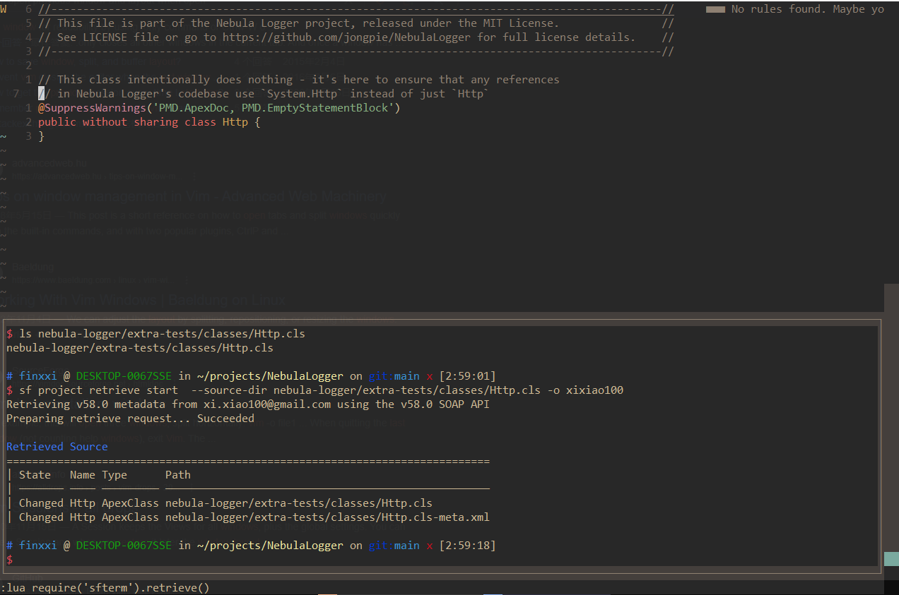
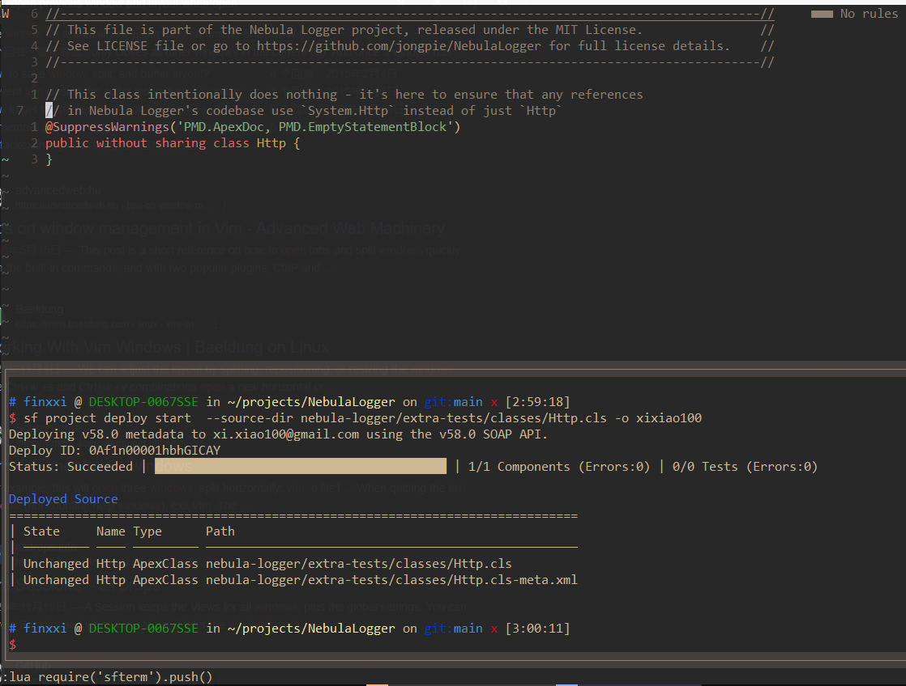

# Description

It creates an integrated terminal in Nvim, and run `sf` commands in it.

Why? A better workflow for some actions comparing to a separate terminal,
because:

- No window switch, toggle on/off in an integrated float window
- Expand special chars (e.g. `%`, `%:p` to the file path) in your command, so it
  works seamlessly with your working buffer (explained below)
- Execute commands without leaving your current working window (explained
  below)

# Features

**Built-in commands:**

- `toggle()` // toggle the terminal on and off;
- `retrieve()` // retrieve current file from Salesforce org;
- `push()` // retrieve current file from Salesforce org;
- `run(command)` // run your own command in terminal;

## 1. Toggle on/off the terminal on a float window

```
:lua require'sfterm'.toggle() // run in Ex;
```
```
vim.keymap.set('n', '<leader>t', '<CMD>lua require("sfterm").toggle()<CR>') // define hotkey;
```


## 2. Execute terminal commands without leaving your working window

`retrieve()` the current file

```
:lua require'sfterm'.retrieve() // run in Ex;
```
```
vim.keymap.set('n', '<leader>t', '<CMD>lua require("sfterm").retrieve()<CR>') // define hotkey;
```



`push()` the current file

```
:lua require'sfterm'.push() // run in Ex;
```
```
vim.keymap.set('n', '<leader>t', '<CMD>lua require("sfterm").push()<CR>') // define hotkey;
```



- support `target_org` value from `sforg.nvim` if it's installed

## 3. Interact with the terminal

It's a terminal wrapped in a buffer in a window. Feel free to enter the window
and hit `i` to enter insert mode to use it.
Note. Exit insert mode in terminal is `<C-\><C-n>`

You can also execute random commands to the terminal without leaving your current
window by:

```
:lua require'sfterm'.run('ls -la')
```

# Credit

Heavily borrowed from [FTerm.nvim](https://github.com/numToStr/FTerm.nvim/tree/master/lua/FTerm)
